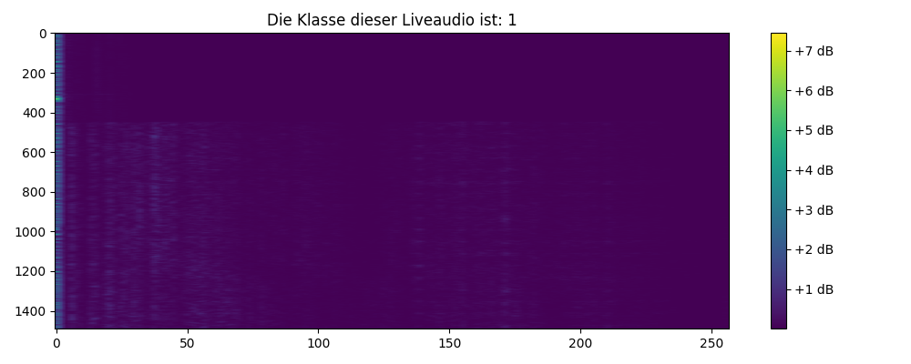

# EchoWatch

## Kurzbeschreibung
Ziel war es ein kompaktes Projekt zu erschaffen, welches von der Erstellung der Datensätze, dem Training eines CNNs bis hin zur Klassifikation neuer Daten bewältigen kann.
Das ist EchoWatch!
EchoWatch ist eine Anwendung mit einem Deep-Learning-Modell zur Klassifikation von Maschinengeräuschen , entwickelt als Teil meiner Bachelorarbeit.

## Inhaltsverzeichnis
- [Installation & Benutzung](#installation--benutzung)
- [Technologie & Frameworks](#technologie--frameworks)
- [Funktionsweise & Features](#funktionsweise--features)
- [Screenshot](#screenshot)
- [Danksagungen](#danksagungen)

## Installation & Benutzung
1. Klonen Sie das Repository auf Ihren lokalen Computer.
2. Erstellen Sie eine neue Python-Umgebung (empfohlen mit Conda oder virtualenv).
3. Installieren Sie die benötigten Bibliotheken mit `pip install -r requirements.txt`.
4. Navigieren Sie zum Projektverzeichnis und führen die `main.py` aus.
5. Wählen Sie aus zwischen einer Vorhersage mit einem Modell und einer Audiodatei: 'predict_with_saved_model'
6. Oder wählen Sie die Echtzeitklassifikation aus: 'live_audio_classification'
   - Bei der Echtzeitklassifizierung muss gegebenenfalls das richtige Mikrofon ausgewählt werden.
     Es wird automatisch eine Liste mit allen Mikrofonen nach Ausführen mit entsprechenden Ziffern angezeigt.

## Technologie & Frameworks
- Python
- TensorFlow
- Matplotlib
- Numpy
- Pandas
- Sounddevice
- TensorFlow IO
- PyDub
- Seaborn
- Scikit-Learn

## Funktionsweise & Features
EchoWatch kann unter anderen eine Echtzeitklassifizierung durchführen oder mit einem geladenen Modell eine bestimmte Audiodatei klassifizieren.
Ein Screenshot von einem Klassifikationsergebniss der Echtzeitklassifikation wird angehangen.

Unter anderem sind in diesem Repository auch verschiedene Ergebnisse enthalte, welche den Rahmen in der Bachelorarbeit gesprengt hätten:
- Alle erstellen Konfusionsmatrizen in dem Ordner models/matrices
- Ergebnisse der Testdatensätze beider finaler Modelle in dem Ordner Results
- Die kompletten Vorhersagen in einer CSV-Datei ebenfalls im Ordner Results

## Screenshot

## Danksagungen
Vielen Dank an meine Schwester für das gründliche Korrekturlesen und hilfreiche Feedback!

